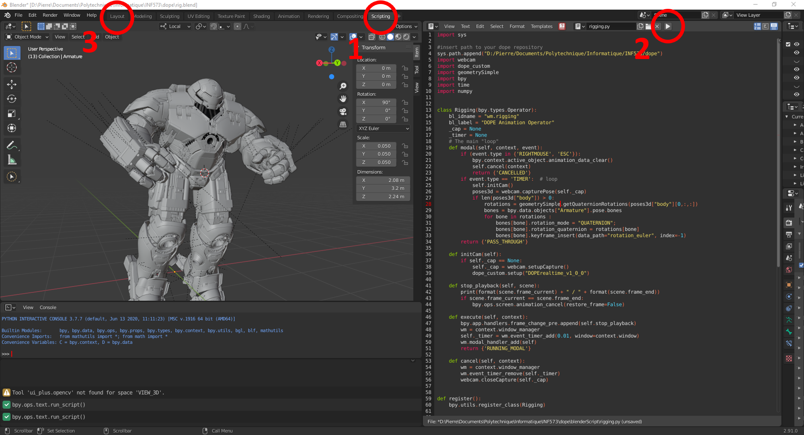
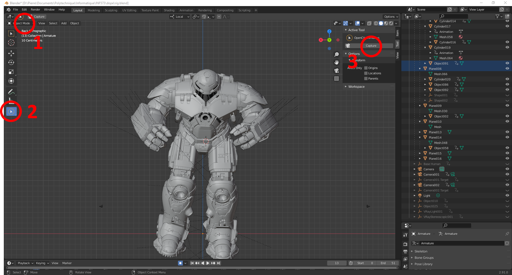

# Realtime 3D Deep Motion Capture

The goal of this project it to makes it possible to have an esay, low-cost motion-capture feature in Blender. It relies on DOPE to detect a body, and uses the Blender API to reproduce the pose on a rigged model.

## DOPE: Distillation Of Part Experts for whole-body 3D pose estimation in the wild

We use DOPE's original code extensively. To see the original github repository [click here](https://github.com/naver/dope). To cite their work :

```bibtex
@inproceedings{dope,
  title={{DOPE: Distillation Of Part Experts for whole-body 3D pose estimation in the wild}},
  author={{Weinzaepfel, Philippe and Br\'egier, Romain and Combaluzier, Hadrien and Leroy, Vincent and Rogez, Gr\'egory},
  booktitle={{ECCV}},
  year={2020}
}
```

### Getting started - with Blender

The fist step is to install Blender (the code has been tested on 2.91). Then go to the path `.../Blender Foundation/Blender 2.91/2.91/python.bin`. There run :
```
python -m pip install --upgrade pip
python -m pip install opencv-python
python -m pip install numpy
python -m pip install scipy
```
Finally, find your CUDA version to choose the best version of pytorch for your system. Install pytorch and torchvision, the same way you installed the other packages. Warning: don't forget to add `python -m` at the beginning of the `pip` command!

#### Download the models

Then in the repository create a folder `models/` in which you should place the downloaded pretrained models.
The list of models include:
* [DOPE_v1_0_0](http://download.europe.naverlabs.com/ComputerVision/DOPE_models/DOPE_v1_0_0.pth.tgz) as used in our ECCV'20 paper
* [DOPErealtime_v1_0_0](http://download.europe.naverlabs.com/ComputerVision/DOPE_models/DOPErealtime_v1_0_0.pth.tgz) which is its real-time version

#### post-processing with a modified version of LCR-Net++

Our post-processing relies on a modified version of the pose proposals integration proposed in the [LCR-Net++ code](https://thoth.inrialpes.fr/src/LCR-Net/).
To get this code, once in the DOPE folder, please clone our modified LCR-Net++ repository:
```
git clone https://github.com/naver/lcrnet-v2-improved-ppi.git
```

Alternatively, you can use a more naive post-processing based on non-maximum suppression by add `--postprocess nms` to the commandlines below, which will result in a slight decrease of performance.

#### Setting path to DOPE

The last step is to copy the path to the repository in your system, and paste it line 4 in the file rigging.py.

#### Start the capture

Your environment is ready to go! Open the project `rig.blend` in Blender, go to the Scripting panel, and run setup.py and rigging.py. Then go to the Layout panel, choose "Object Mode" in the top left corner, select the tool "OpenCV Animation" on the left side and launch the capture with the tool "Capture" on the right side of main panel/.






### Getting started - without Blender

To use only the capture part without Blender, install the following packages in you Python environment :
1. Pytorch
2. Torchvision
3. numpy / scipy
4. OpenCV
5. matplotlib

Then run

```
python webcam.py --save filename --dim3
```

with
* `<filename>`: name of the file to store the 2D stream (optional) (create a folder `output` before)
* `--dim3` or `-d` launches an additionnal matplotlib window with the 3D pose.

Our real-time models use half computation. In case your device cannot handle it, please uncomment the line `  #ckpt['half'] = False` in `dope.py`.


